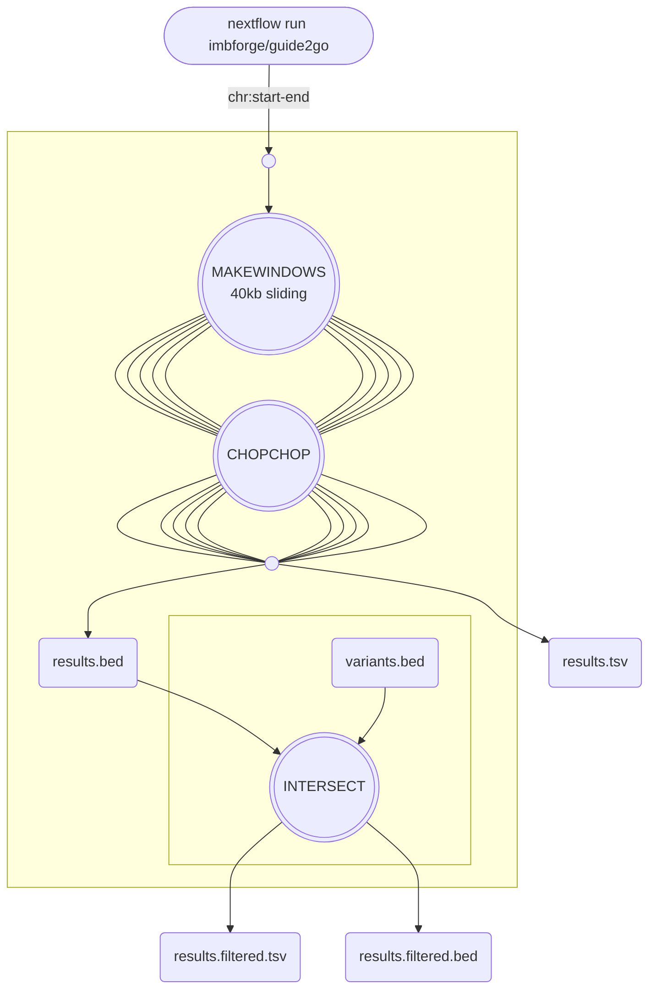

# guide2go

## Description

This is a small nextflow pipeline to find CRISPR targets in larger genomic regions.
It uses the [cli version](https://bitbucket.org/valenlab/chopchop) of [chopchop](http://chopchop.cbu.uib.no/) and generates 40kb sliding windows for parallel processing.
At the end, potential targets across all windows are merged and can (optionally) be filtered for the presence of allelic SNPs within their respective PAM sequence.

## Usage

```bash
nextflow imbforge/guide2go --CHROM <chromosome_identifier> --START <start_coordinate> --END <end_coordinate> --ORGANISM <hg38|mm10> --ALLELES <path/to/vcf|path/to/bed>
```

## Overview

